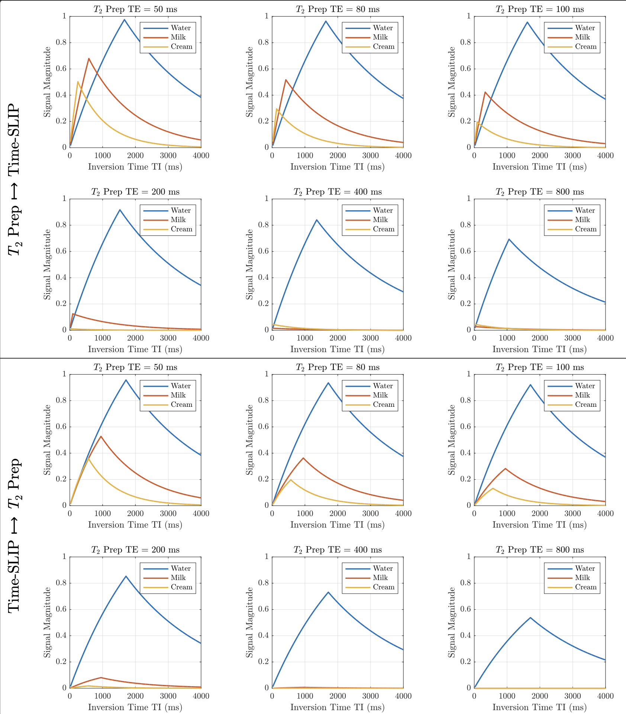

# Time-SLIP T2prep Simulation

This repository contains a MATLAB function designed to simulate and plot Time-SLIP MRI sequences with an integrated T2prep module. The function allows for modeling of different tissue properties and sequence configurations to optimize MRI imaging of fluid dynamics, such as cerebrospinal fluid (CSF) flow. The tool is versatile and can be used for any fluid or tissue type by adjusting T1 and T2 values.

## Features

- Simulates the effects of the Time-SLIP sequence with T2prep module integration.
- Allows testing of different T2prep durations and inversion times.
- Plots results for each tissue type and saves the figures as PDFs for detailed analysis.

## Function Description

### Inputs
- **tissues (cell array)**: Cell array containing tissue names and properties. Each row follows the format `{'Name', T1, T2}`, where T1 and T2 are in milliseconds.
- **TEeffective_values (1D array)**: Array of effective T2 preparation echo times (TE) in milliseconds.
- **TI_values (1D array)**: Array of inversion times (TI) in milliseconds.

### Output
- The function plots the results for each tissue type and sequence configuration and saves the figures as PDFs.

### Example Usage
~~~
tissues = {
    'Water', 2500, 1300;  
    'Milk', 1400, 80; 
    'Cream', 850, 50;
};
TEeffective_values = [50, 100, 150, 200, 300, 400];
TI_values = 20:100:4000;
TimeSlip_t2prep(tissues, TEeffective_values, TI_values);
~~~

## Subroutines

The function includes the following subroutines:

- `simulate_case`
- `apply_TimeSlip_first`
- `apply_T2prep_first`
- `apply_TimeSlip_only`
- `plot_universal_results`
- `plot_SIR`
- `store_results`
- `initialize_arrays`
- `relaxation`
- `T2prep`
- `rotation`

## Example Results

The figure above shows an example of the output generated by the simulation, illustrating the signal variations for different tissue types and T2prep durations.

## Author

Vadim Malis  
University of California, San Diego  
Email: [vmalis@ucsd.edu](mailto:vmalis@ucsd.edu)

## License

This project is licensed under the MIT License - see the LICENSE file for details.
